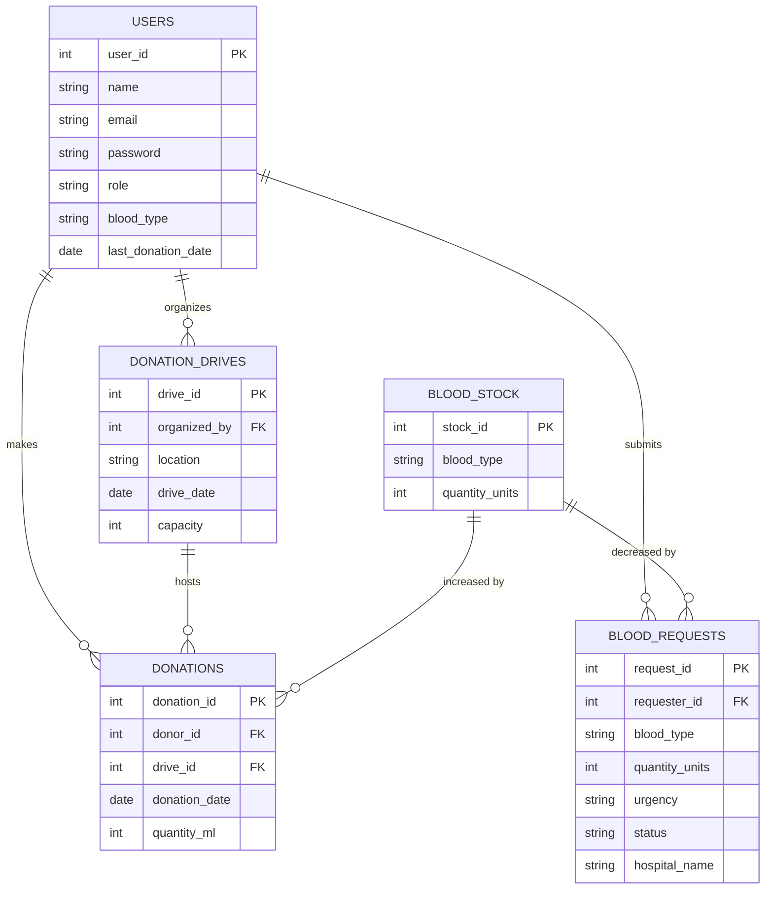
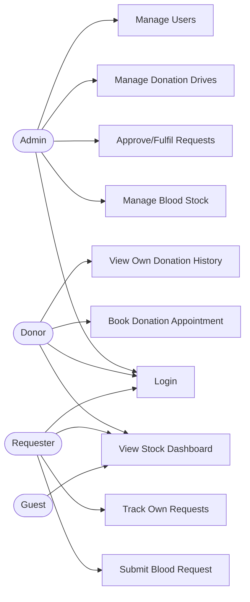

# Project Proposal: PHP + MySQL Application

> **Course:** J620-002-4:2020 Front-End Software Development (Level 4)
> **Competency Unit:** J620-002-4:2020-C01
> **Instructions: Replace** every [ ... ] and delete the hint lines (starting with >) before submitting. Keep this file as README.md in the root of your project repository.
---

## 1. Student Details

| Field | Your Answer |
|---|---|
| Candidate Name | Kang Kaiven |
| NRIC Number | [ 070227070665] |
| Date Submitted | [23/9/2026] |

---

## 2. Project Title

**BloodLink — Blood Donation & Emergency Request Management System**

### One-line summary
A web platform that connects blood donors, hospitals, and a blood bank admin to manage donations, track blood stock in real time, and match urgent blood requests with eligible donors.

---

## 3. Problem Statement & Purpose

Blood banks and hospitals often coordinate blood donations and requests through manual records, phone calls, or spreadsheets, which makes it slow and error-prone to know which blood types are running low or which donors are currently eligible to give blood (donors must wait a minimum period between donations). This is especially risky during urgent, time-sensitive requests, where delays in finding the right blood type can have serious consequences.

BloodLink solves this by giving the blood bank a live view of stock levels, letting hospitals submit and track requests digitally, and letting donors see their eligibility and book donation appointments — all in one system. It is aimed at blood bank staff, partner hospitals, and registered donors in a local community.

---

## 4. Tech Stack

| Layer | Technology |
|---|---|
| Markup | HTML |
| Styling | CSS |
| Server-side | PHP |
| Database | MySQL |

---

## 5. Types of Users (Roles)

| Role | Description |
|---|---|
| Admin | Blood bank staff who manage donor records, blood stock, donation drives, and approve/fulfil requests |
| Donor | Registered individuals who book donation appointments and track their donation history and eligibility |
| Requester | Hospital staff (or a patient's representative) who submit and track blood requests |

### Role-Based Access Matrix

| Feature / Page | Admin | Donor | Requester | Guest (not logged in) |
|---|:---:|:---:|:---:|:---:|
| Register / Login              | ✅ | ✅ | ✅ | ✅ |
| View public stock dashboard   | ✅ | ✅ | ✅ | ✅ |
| Book a donation appointment   | ✅ | ✅ | ❌ | ❌ |
| View own donation history     | ❌ | ✅ | ❌ | ❌ |
| Submit a blood request        | ❌ | ❌ | ✅ | ❌ |
| Track own request status      | ❌ | ❌ | ✅ | ❌ |
| Manage blood stock records    | ✅ | ❌ | ❌ | ❌ |
| Approve/fulfil requests       | ✅ | ❌ | ❌ | ❌ |
| Create/manage donation drives | ✅ | ❌ | ❌ | ❌ |
| Manage all users              | ✅ | ❌ | ❌ | ❌ |

---

## 6. Features

### 6.1 Core Features (must have)

- [ ] User registration and login (with role selection: Donor)
- [ ] Role-based access control (each role sees/does different things)
- [ ] Data management (Create, Read, Update, Delete) for donations, requests, and stock
- [ ] Blood stock inventory tracking by blood type, auto-updated on donation/fulfilment
- [ ] Donation appointment booking with eligibility check (based on last donation date)
- [ ] Blood request submission with urgency level (Critical / Normal) and admin approval workflow

### 6.2 Extra Features (nice to have)

- [ ] Public guest-accessible dashboard showing current stock levels per blood type
- [ ] Low-stock alert banner on the admin dashboard for blood types below a threshold
- [ ] Donation drive scheduling with a signup list

### 6.3 Feature Descriptions

| Feature | Description | Role(s) |
|---|---|---|
| Eligibility check | System calculates whether a donor is eligible to donate again based on their last donation date, and hides the booking option if not | Donor |
| Stock auto-update | Blood stock quantity automatically increases when a donation is confirmed and decreases when a request is fulfilled | Admin (triggered by donations/requests) |
| Urgent request matching | Requests marked "Critical" are highlighted for the admin and filtered against currently eligible donors of the matching blood type | Admin, Requester |
| Request approval workflow | Requester submits a request; Admin reviews stock availability and approves, rejects, or marks it fulfilled | Admin, Requester |
| Donation drive management | Admin creates drives (location, date, capacity); donors can view and book a slot at a drive | Admin, Donor |

---

## 7. Data Management System

| Data / Entity | Create | Read | Update | Delete |
|---|---|---|---|---|
| Users | Admin, Self (register) | Admin, Self | Admin, Self | Admin |
| Donations | Admin, Donor (booking) | Admin, Donor (own) | Admin | Admin |
| Donation Drives | Admin | Admin, Donor, Requester, Guest | Admin | Admin |
| Blood Stock | Admin (auto via donations/requests) | Admin, Requester, Guest | Admin | Admin |
| Blood Requests | Requester | Admin, Requester (own) | Admin | Admin |

---

## 8. Database Design

### Entity Relationship Diagram (ERD)

---

## 9. Use Case Diagram

---

## 10. Presentation Checklist

- [ ] Can explain the purpose of the application
- [ ] Can justify design choices (why this database structure, why these roles)
- [ ] Can demo every role
- [ ] Can answer questions about my own code
- [ ] Submitted on time
